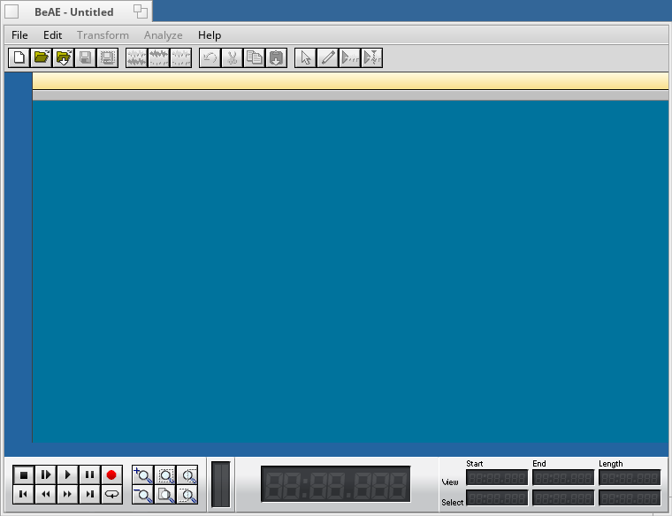

BeAe audio editor for Haiku applications. Has wide functionality.

Features: 
Fade-int function 
Fade-out function 
Function Normilize 
Bass bost function 
Compressor function 
Amplifier 
Delay 
Reverb 
Room Effects 
Invert opportunity 
Exchange channels possibility 
